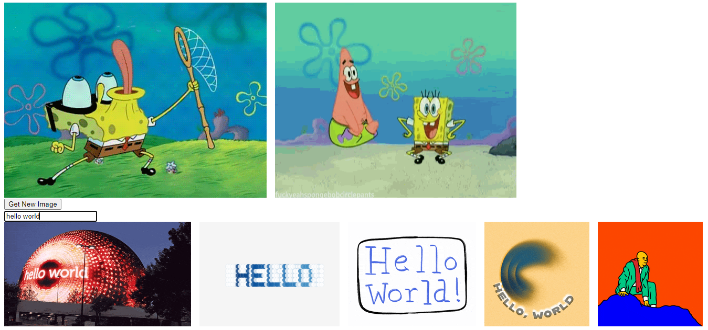

# fetch-gifs

This project demonstrates usage of the Giphy API in combination with the JS Fetch API to display GIF images on a web page. The main features include displaying an initial GIF, fetching a new GIF on button click, and searching for GIFs based on user input.

Live Preview: https://taewookim02.github.io/fetch-gifs/

## Features

- Display an initial GIF on page load.
- Fetch and display a new GIF when the "Get New Image" button is clicked.
- Search for GIFs and display the results based on user input.

## Technologies Used

- HTML
- CSS
- JavaScript
- Fetch API
- Giphy API
